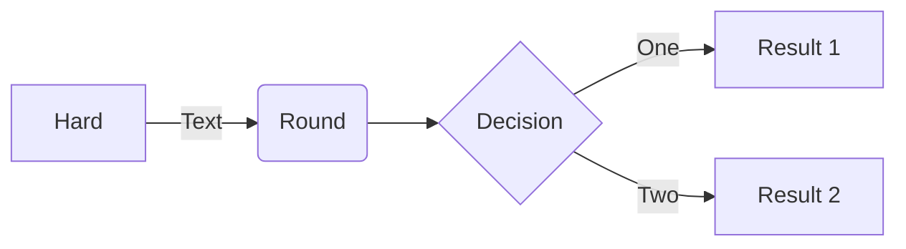

# About
This repo bring us a simple chat app, which is based on these techs
* Docker / Compose
* python / Django
* WebSocket
* Postgres

TODO git/mp4 here

## Screenshots


## Usage
### Dependency
* Docker

### Command
```sh 
# clone this repo
git clone 

# compose containers app"web" and "db" with Docker compose
docker compose up
```

## Author
Por

## Diagram

